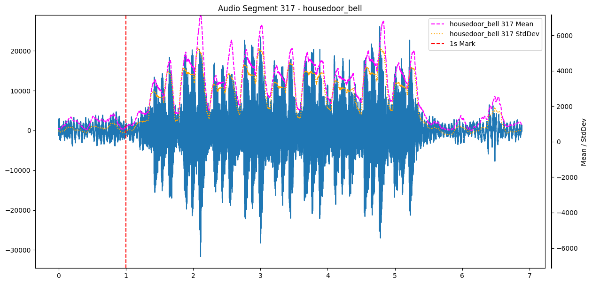

In my [previous post](https://www.saadeh.dev/blog/001-doorbell-detector-introduction/) I covered the monivation for this porject and sketeched out my first ideas.
This post is going to dive into my first attempt of data collection, including my considerations, some insights into the data and the tools I used for labeling.

# The role of data

Collecting data is reasonably one of the most important continous tasks during machine learning lifescycle.
Without proper data, training might be useless or at least less effective, since data is the base input for this process.
However, the biggest question is: how do I get this data?

# The Cold Start Problem

This question is the primary challange for the "Cold Start Problem". This term has been coined originally for recommender systems, but also fits into a general machine learning environment.
How do I get the data I need to provide the function I want to realize?
There are a few options for mitigate this ranging from manual data collection and labeling to synthetic data generation.
In my case I decided for an hybrid approach.

# My Data Collection Process

My strategy involved the following steps:

1. Create records of my doorbell
2. Create records of the background noise
3. Create records of my doorbell with background noise

Looks like a simple three step approach and it's fairly naive. It didn't consider edge cases, but for the first try it was enough.
I wanted to have a pretty bad estimator at the beginning based on simple handmade rules to collect continously data.
Afterwards I planned to check the classifications, relabel them manually if necessary and start with training of my first model.
So, what handmade rule should I build for data collection?

# Dive into the data

To get a grip on the data I picket some examples and visualized them with a few statistical measurements.
They look like this:

The dashed red line is the start of the jingle, I also added the mean (dashed megenta) and the standard deviation (dashed yellow) with a sliding window of 100ms.
The base rule has been found pretty fast: alway keep about 1s of recording in a buffer (so nothing is missed) and as soon the mean surpasses a threshold I start to record for 6 seconds.

The plot above looks quite appealing, but I also got some doorbell recordings with noise:

I cannot remember what it was, but the characteristics of the doorbell isn't visible anymore, at least in this vizualization.
In a spectrogram this may look different.

However, I got my threshold based rule. Simple, nice and a lot potential for false positives, i.e. detecting doorbells, which are not there.
That was something I just counted for, because the more data the better.
Well, lets see what happened later.

# Labeling

I worked with [CVAT](https://www.cvat.ai/) Community Edition before to manage image data, so it was not qualified for my purpose.
So I searched for an alternative and left at [Label Studio](https://labelstud.io/), since it also supported audio data and was open source.
Taking a deeper look into the versatile [label templates](https://labelstud.io/templates/) I would also give it a try for future computer vision projects.

I setup my Label Studio instance as a docker within an LXC container on my homeserver, so I keep the complete setup within my local network.

# Capture Device -> Labeling Instance

As mentioned in my [previous post](https://www.saadeh.dev/blog/001-doorbell-detector-introduction/) I use an Raspberry Pi Zero W with a microphone hat.
So, how do I transport recordings to my Label Studio instance?
I decided to use an SMB share, since it's already provided by my router.
It's been mounted to both, the Microphone SBC and the Label Studio host container, and synced via Label Studio's [local storage sync](https://labelstud.io/guide/storage_local).

# First load of data incoming

