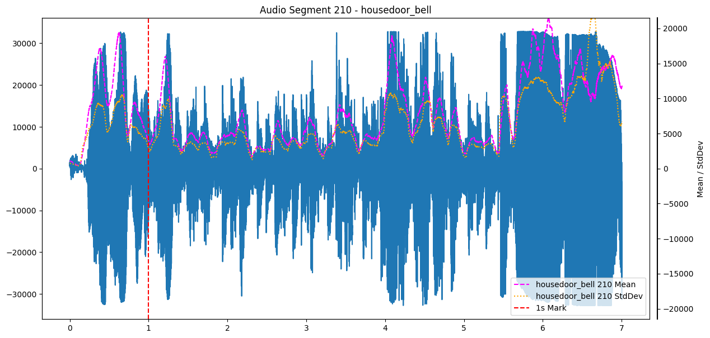
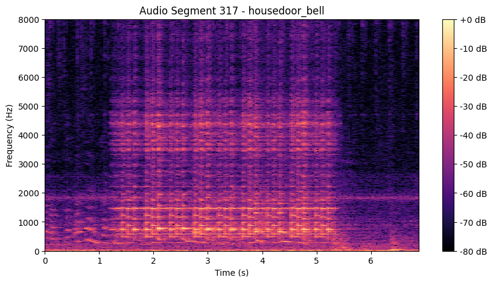
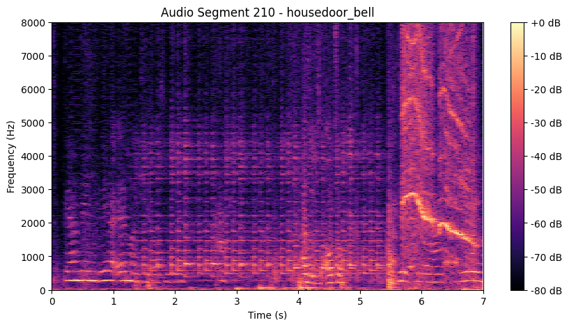
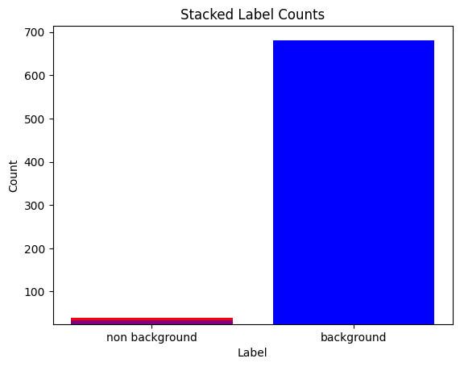

In my [previous post](https://www.saadeh.dev/blog/001-doorbell-detector-introduction/) I covered the motivation for this project and sketched out my first ideas.
This post is going to dive into my first attempt of data collection, including my considerations, some insights into the data and the tools I used for labeling.

# The role of data

Collecting data is arguably one of the most important continuous tasks during the machine learning lifecycle.
Without proper data, training might be useless or at least less effective, since data is the base input for this process.
However, the biggest question is: how do I get this data?

# The Cold Start Problem

This question is the primary challenge of the "Cold Start Problem". This term was originally coined for recommender systems, but also fits into a general machine learning context.
It is about that you initally need data to train and evaluate an ml algorithm, before you can establish a feedback loop for improvement.
How do I get the data I need to provide the function I want to realize?

<comment>Resolved in substance — the definition is there now. But the new sentence is grammatically tangled: "It is about that you initally need data..." doesn't parse in English. Suggest something like: "The core issue: you need data to train and evaluate an ML model before any feedback loop for improvement can exist." (Also: "initally" → "initially", "ml" → "ML".)</comment>

There are a few options for mitigating this, starting from manual data collection and labeling to complete automated synthesis of complete data and anything in between.
To keep things simple and controllable I decided for manual datacollection and first and put some semi-automated data collection and labeling afterwards.

<comment>Resolved — the plan (manual first, semi-automated later) is now concrete and matches the rest of the post. But both new sentences are garbled: "complete automated synthesis of complete data" doubles "complete", and "I decided for manual datacollection and first and put some semi-automated data collection and labeling afterwards" has a stray "and" plus "datacollection". Suggest: "...ranging from manual collection and labeling to fully automated data synthesis. To keep things simple and controllable, I started with manual data collection and added some semi-automated collection and labeling later."</comment>

# My Data Collection Process

My strategy involved the following steps:

1. Create records of my doorbells (I got multpile sound depending on the door to I need to answer)
2. Create records of the background noise (anything which is *not* any of my doorbells)
3. Create records of my doorbells with background noise

<comment>The multiple-doorbells point is fixed. Still open: steps 2 and 3 are never picked up again — the rest of the post only describes the threshold-triggered recorder. Did you deliberately stage recordings (ring the bell on purpose, with and without noise playing), or did all three kinds of data come from the same passive recorder? One sentence resolving this would do. (Also, the new parenthetical is garbled: "I got multpile sound depending on the door to I need to answer" → e.g. "I have multiple jingles, depending on which door needs answering".)</comment>

Looks like a simple three step approach and it's fairly naive. It didn't consider edge cases, but for the first try it was enough.
I wanted to have a rough estimator at the beginning based on simple handmade rules to continuously collect data.
Afterwards I planned to label them manually if and start with training of my first model.

<comment>Mostly resolved. Leftover editing artifact: "label them manually if and start with training" — the "if" is a remnant of "if necessary". Also "them" now has no clear referent (the previous sentence talks about the estimator, not the recordings); suggest "label the captured recordings manually and start training my first model".</comment>

So, what handmade rule should I build for data collection?

# Dive into the data

To get a grip on the data I picked some examples and visualized them with a few statistical measurements.
They look like this:

The dashed red line is the start of the jingle, I also added the mean (dashed magenta) and the standard deviation (dashed yellow) of the elongation with a sliding window of 100ms.

<comment>"Elongation" doesn't work in English — it reads as the German "Elongation" (Auslenkung); English readers expect "amplitude", "displacement", or "waveform". And the underlying question remains: the raw waveform is zero-centered, so its sliding mean stays near zero no matter how loud it gets. If the plotted mean is over the *absolute* amplitude (or signal energy), say so explicitly — otherwise the threshold rule below doesn't make sense to a careful reader.</comment>

The base rule was found pretty quickly: always keep about 1s of recording in a buffer (so nothing is missed) and as soon as the mean within my 100ms window surpasses a threshold, start recording for 6 seconds, which is roughly the length of my doorbell sounds plus some margin.
The threshold is a rough manual estimate from a few clean samples compared to recordings with no sound, so only the white noise background.

The plot above looks quite appealing, but I also got some doorbell recordings with noise:

I cannot remember what it was, but the characteristics of the doorbell isn't visible anymore, at least in this vizualization.
For the sake of completement, here are spectrograms of these audio segments:

You may see some patterns and a clear start of the jingle at least in the clean recording.
In the noisy recording this is less visible.

<comment>The spectrograms resolve the dangling thought nicely. Two small follow-ups: (1) "You may see some patterns" — guide the reader's eye: name what to look for (e.g. the jingle's harmonic stack / distinct horizontal frequency bands after the red line). (2) The noisy example still leaves an interesting question unanswered: was this recording triggered by the bell itself, or was the recorder already running because the background noise alone exceeded the threshold? One sentence on that turns this example from "huh, messy" into an insight about how the rule behaves under noise. (Typo: "completement" → "completeness".)</comment>

However, I got my threshold based rule. Simple, nice and a lot potential for false positives, i.e. detecting doorbells, which are not there.
That was something I just accounted for, because the "more data the better".
As a side effect this also reduces false negatives, since the doorbell should have a minimum volume.
Well, lets see what happened later.

<comment>The false-negative point is addressed now. One logical nit in the new sentence: accepting false positives doesn't itself reduce false negatives — the *low threshold* causes both. Consider "Keeping the threshold low also reduces false negatives, since any doorbell ring should comfortably exceed it." Otherwise resolved.</comment>

# Labeling

I worked with [CVAT](https://www.cvat.ai/) Community Edition before to manage image data, so I wanted something similar to handle labels systematically.
CVAT itself was unfortunatly only designed for image and video annotation, so not usable for my purpose.

So I searched for an alternative and settled on [Label Studio](https://labelstud.io/), since it also supported audio data and was open source.
After taking a deeper look at the versatile [label templates](https://labelstud.io/templates/), I would also consider it for future computer vision projects.
I labeled parts of the clip within the visual editor with the labels front_door, flat_door, garden_door, ambient/background (I was a bit inconsistent for the name of the negative class).

I setup my Label Studio instance as a docker within an LXC container on my homeserver, so I keep the complete setup within my local network.
This decision is partly driven by privacy, even though I have running a few Alexa devices running.
On the other hand I already got a significant amount of infrastructure at home, so underutilzing it seemed wo be wasteful to me.

<comment>Much better — the self-aware "partly driven by privacy, even though I run Alexa devices" works now, and the infrastructure argument is a good second reason. Remaining: both sentences have editing slips — "I have running a few Alexa devices running" (double "running") and "underutilzing it seemed wo be wasteful" ("underutilizing", "wo" → "to"). Optional: one clause on why local still matters despite the Alexas (continuous raw audio of your home is a different beast than wake-word snippets) would make the privacy argument airtight.</comment>

# Capture Device -> Labeling Instance

As mentioned in my [previous post](https://www.saadeh.dev/blog/001-doorbell-detector-introduction/) I use an Raspberry Pi Zero W with a microphone hat.
So, how do I transport recordings to my Label Studio instance?
I decided to use an SMB share, since it's already provided by my router.
It's been mounted to both, the Microphone SBC and the Label Studio host container, and synced via Label Studio's [local storage sync](https://labelstud.io/guide/storage_local).

# First load of data incoming

As already mentioned, I decided to go with a simple threshold approach for data collection.
So I prepared the Raspberry Pi Zero with the microphone hat (which was an odyssey itself, but that's another story) and placed my recording script.
For some time it worked quite well — typical false positives were voices and slamming doors.
However, it worked until my vacuum robot hit, which generated a big amount of data just with noise.
Luckily I was aware of this because I supervised the recording campaigns and got proper timestamps, so I used the Label Studio API to automatically label all these vacuum records as background, but the distribution looked like this in the end:

<comment>The "how did you know" gap is closed (supervised campaigns + timestamps). Still unaddressed: bulk-labeling *all* vacuum clips as background is a labeling risk — if the doorbell rang while the vacuum was running, that ring is now mislabeled as background, and it's exactly the hard positive example a model would need most. Worth one sentence, even if just "since I supervised the campaign, I knew no ring happened during those windows" or "I accepted the risk".</comment>

Internally I distinguished between different doorbell types, which is why I chose the stacked histogram for visualization.
You may see the heavy skew in my dataset, a few dozen doorbell recordings vs almost 700 recordings for background.
This left me struggling during training, but this is something for the next post.

<comment>Mostly resolved — the doorbell types are introduced earlier now and the numbers (a few dozen vs. ~700) make the skew concrete. One last datum that would round it off: the collection period. "A few dozen rings" means something very different over a week than over three months, and it tells the reader how fast this dataset can realistically grow — which matters for the training struggles the next post will cover.</comment>
